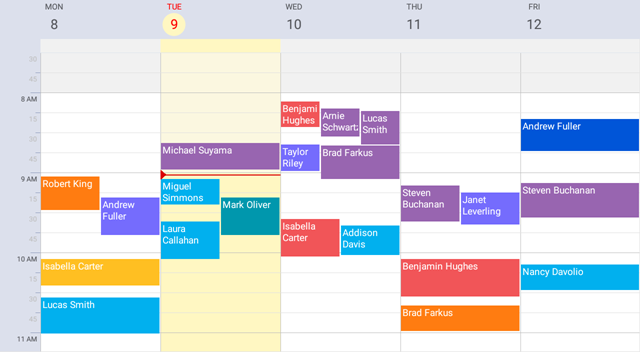

<!-- default file list -->
*Files to look at*:

* [MainPage.xaml](./Scheduler_CustomAppearance/MainPage.xaml)
* [MainPage.xaml.cs](./Scheduler_CustomAppearance/MainPage.xaml.cs)
* [ReceptionDeskData.cs](./Scheduler_CustomAppearance/ReceptionDeskData.cs)
* [ViewModel.cs](./Scheduler_CustomAppearance/ViewModel.cs)

<!-- default file list end -->
# Customize Scheduler Appearance
This example shows how to modify the [work week view](https://docs.devexpress.com/MobileControls/400677/xamarin-forms/scheduler/views/views#work-week-view) appearance. For a complete description, refer to the following help topic: [Change Scheduler Appearance](https://docs.devexpress.com/MobileControls/401102/xamarin-forms/scheduler/examples/scheduler-custom-appearance).

To run the application:
1. [Obtain your NuGet feed URL](http://docs.devexpress.com/GeneralInformation/116042/installation/install-devexpress-controls-using-nuget-packages/obtain-your-nuget-feed-url).
2. Register the DevExpress NuGet feed as a package source.
3. Restore all NuGet packages for the solution.
