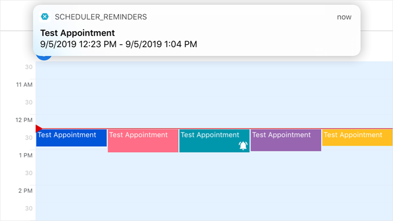

<!-- default file list -->
*Files to look at*:  

**Shared Project**
* [MainPage.xaml](./Scheduler_Reminders/MainPage.xaml)
* [MainPage.xaml.cs](./Scheduler_Reminders/MainPage.xaml.cs)
* [Model.cs](./Scheduler_Reminders/Model.cs)
* [ViewModel.cs](./Scheduler_Reminders/ViewModel.cs)
* [App.xaml.cs](./Scheduler_Reminders/App.xaml.cs)
* [RemindersNotificationCenter.cs](./Scheduler_Reminders/RemindersNotificationCenter.cs)

**iOS Project**
* [NotificationCenter.cs](./Scheduler_Reminders.iOS/NotificationCenter.cs)
* [AppDelegate.cs](./Scheduler_Reminders.iOS/AppDelegate.cs)

**Android Project**
* [NotificationCenter.cs](./Scheduler_Reminders.Android/NotificationCenter.cs)
* [NotificationAlarmHandler.cs](./Scheduler_Reminders.Android/NotificationAlarmHandler.cs)
* [MainActivity.cs](./Scheduler_Reminders.Android/MainActivity.cs)

<!-- default file list end -->
# Reminders
This example describes how to:  
- Enable the **Edit Appointment** form that allows users to add reminders to appointments.
- Plug reminders into the iOS and Android alarm systems so that they send notifications outside the application's UI.
Each notification includes appointment subject and time interval.
- Handle reminder notifications to open an edit form for the corresponding appointments when a user taps notifications.  

For a complete description, refer to the following help topic: [Manage Reminders](https://docs.devexpress.com/MobileControls/401223/xamarin-forms/scheduler/examples/reminders).

To run the application:
1. [Obtain your NuGet feed URL](http://docs.devexpress.com/GeneralInformation/116042/installation/install-devexpress-controls-using-nuget-packages/obtain-your-nuget-feed-url).
2. Register the DevExpress NuGet feed as a package source.
3. Restore all NuGet packages for the solution.
