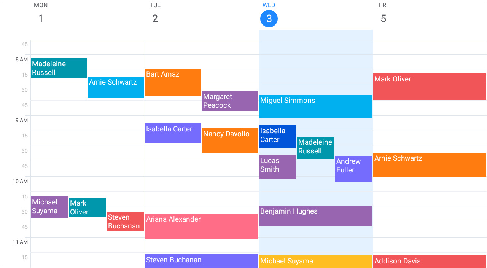
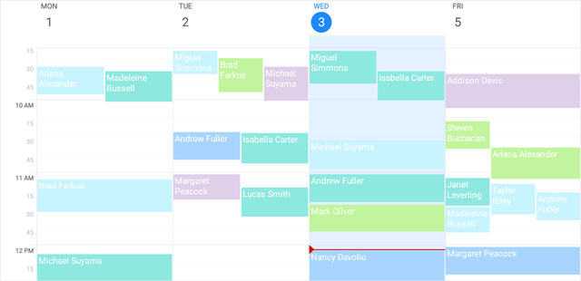

<!-- default file list -->
*Files to look at*:

* [ReceptionDeskData.cs](./Scheduler_GettingStarted/ReceptionDeskData.cs)
* [ViewModel.cs](./Scheduler_GettingStarted/ViewModel.cs)
* [MainPage.xaml](./Scheduler_GettingStarted/MainPage.xaml)
* [MainPage.xaml.cs](./Scheduler_GettingStarted/MainPage.xaml.cs)
* [App.xaml.cs](./Scheduler_GettingStarted/App.xaml.cs)
<!-- default file list end -->
# Scheduler - Getting Started

The example contains the source code of the application created in the [Getting Started](https://docs.devexpress.com/MobileControls/400687/xamarin-forms/scheduler/getting-started/index) tutorial. It demonstrates the basic functionality of the DevExpress Scheduler for Xamarin.Forms, and includes the following steps:
- [Bind Scheduler to Data](https://docs.devexpress.com/MobileControls/400681/xamarin-forms/scheduler/getting-started/lesson-1-bind-scheduler-to-data)
- [Configure Scheduler View](https://docs.devexpress.com/MobileControls/400685/xamarin-forms/scheduler/getting-started/lesson-2-specify-scheduler-view)
- [Enable the Edit Appointment Form](https://docs.devexpress.com/MobileControls/400701/xamarin-forms/scheduler/getting-started/lesson-3-edit-appointment)
- [Create Custom Labels](https://docs.devexpress.com/MobileControls/400686/xamarin-forms/scheduler/getting-started/lesson-4-custom-labels-and-statuses)

  

To run the application:
1. [Obtain your NuGet feed URL](http://docs.devexpress.com/GeneralInformation/116042/installation/install-devexpress-controls-using-nuget-packages/obtain-your-nuget-feed-url).
2. Register the DevExpress NuGet feed as a package source.
3. Restore all NuGet packages for the solution.